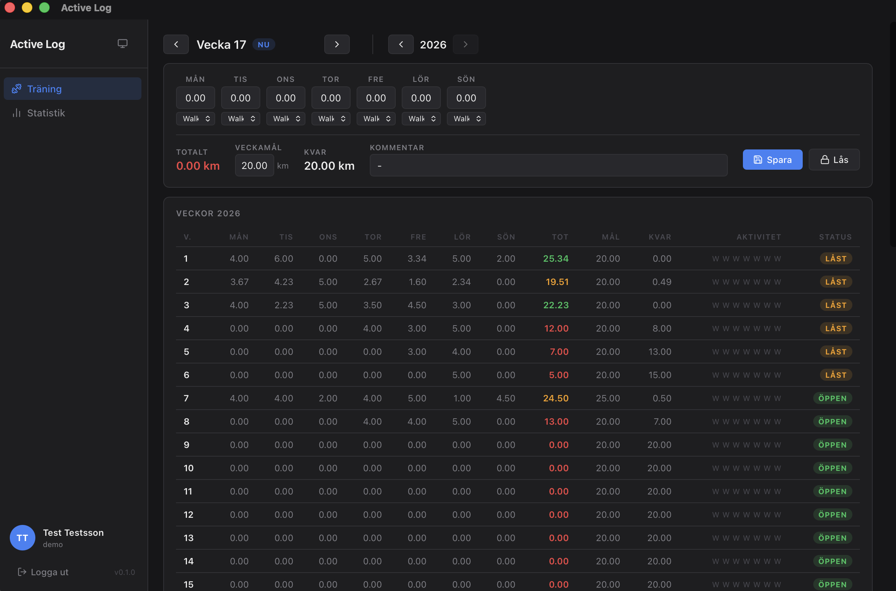

# Active Log — DMG Distribution

---

## Svenska

Installationsfil (disk image) för Active Log-appen till macOS.

### Installation

1. Öppna `.dmg`-filen
2. Dra **Active Log.app** till Applications-mappen
3. Mata ut disk imagen
4. Starta Active Log från Applications eller Spotlight

### Funktioner

- Logga aktiviteter som promenad, jogging, löpning och cykling
- Spåra distans per vecka med anpassningsbara mål
- Översikt över din träningshistorik

### Krav

- macOS 12.0 eller senare
- Apple Silicon (M1 eller senare)

---

## English

Installer disk image for the Active Log macOS app.

### File

`Active Log_0.1.0_aarch64.dmg` — Apple Silicon (aarch64)

### Installation

1. Open the `.dmg` file
2. Drag **Active Log.app** to the Applications folder
3. Eject the disk image
4. Launch Active Log from Applications or Spotlight

### Features

- Log activities such as walks, jogging, running, and cycling
- Track weekly distance with customizable goals
- Overview of your activity history

### Requirements

- macOS 12.0 or later
- Apple Silicon (M1 or later)
