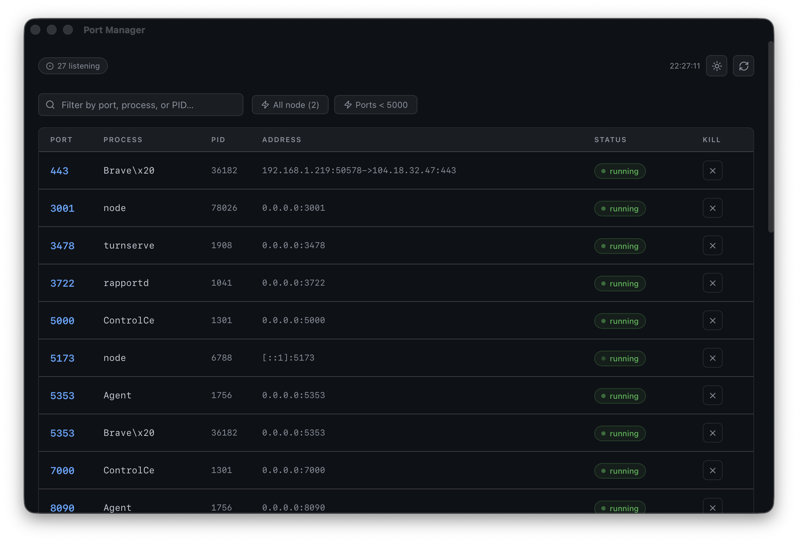

# Port Manager — DMG Distribution

---

## Svenska

Installationsfil (disk image) för Port Manager-appen till macOS.

### Installation

1. Öppna `.dmg`-filen
2. Dra **Port Manager.app** till Applications-mappen
3. Mata ut disk imagen
4. Starta Port Manager från Applications eller Spotlight

### Funktioner

- Listar alla aktiva portar på din dator med processinformation
- Avsluta valfri process direkt i appen med ett klick

### Krav

- macOS 12.0 eller senare
- Apple Silicon (M1 eller senare)

---

## English

Installer disk image for the Port Manager macOS app.

### File

`Port Manager_0.1.0_aarch64.dmg` — Apple Silicon (aarch64)

### Installation

1. Open the `.dmg` file
2. Drag **Port Manager.app** to the Applications folder
3. Eject the disk image
4. Launch Port Manager from Applications or Spotlight

### Features

- Lists all active ports on your machine with process info
- Kill any process directly from the app with one click

### Requirements

- macOS 12.0 or later
- Apple Silicon (M1 or later)
